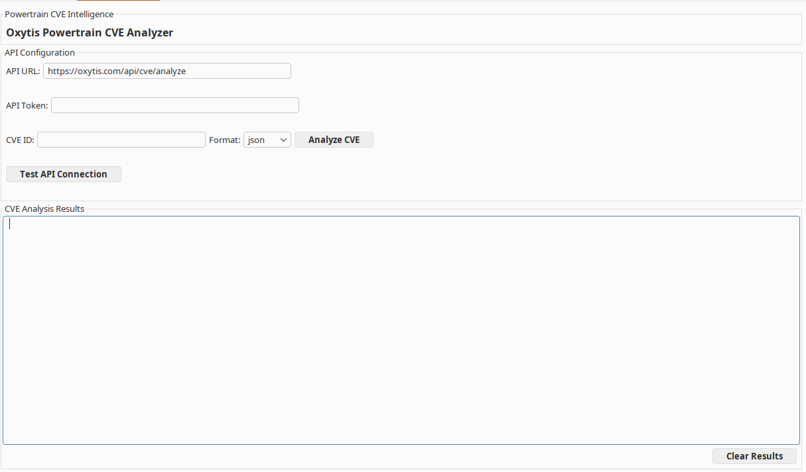
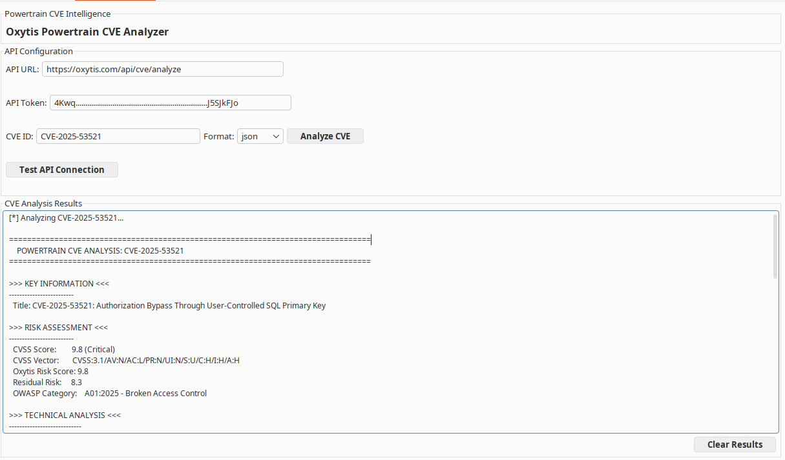
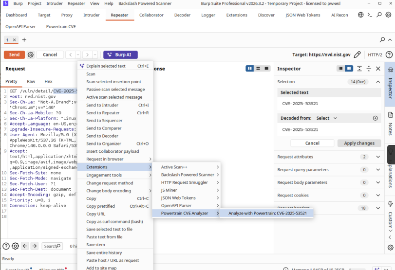

# Powertrain Analyzer for Burp Suite

<p align="center">
  
  
  
  
</p>

A professional Burp Suite extension that integrates **Oxytis Powertrain vulnerability intelligence** directly into your security testing workflow. Analyze published CVEs *and* assess scan findings that have no CVE, with risk scoring and actionable remediation guidance — without leaving Burp Suite.

## 🚀 Features

- **🔍 Real-time CVE Analysis** - Instant access to detailed vulnerability intelligence
- **🧪 No-CVE Finding Assessment** - Right-click any Burp Scanner issue to get an estimated CVSS v4.0 score for findings that have no published CVE
- **📊 Accurate CVSS v4.0 Scoring** - Vectors scored deterministically via FIRST's official `cvss` library (real MacroVector lookup, not an approximation), covering subsequent-system impact (SC/SI/SA)
- **📈 EPSS Enrichment** - Exploit Prediction Scoring System data surfaced alongside CVSS in CVE analysis
- **🧠 SOO Model Analysis** - Patent-pending Subject-Object-Opportunity framework
- **🛡️ HEXAD Security Primitives** - Comprehensive impact analysis across six security domains
- **📋 OWASP Top 10 Mapping** - Automatic categorization to current OWASP standards
- **🖱️ Context Menu Integration** - Right-click CVE IDs *or* Scanner issues anywhere in Burp to analyze
- **🔒 Privacy by Default** - Finding evidence is sent as shape only (no hostname, bodies, cookies, or credential values), with a payload preview before anything leaves Burp
- **📄 Professional Reports** - Clean, formatted output perfect for security assessments
- **⚡ Background Processing** - Non-blocking API calls keep Burp responsive

## 📸 Screenshots

### Main Interface


### CVE Analysis Output


### Context Menu Integration


## 🛠️ Installation

### Prerequisites
- Burp Suite Professional or Community Edition
- Python support enabled in Burp (Jython)
- Active internet connection for API access

### Step-by-Step Installation

1. **Download the Extension**
   ```bash
   git clone https://github.com/oxytis/powertrain-burp-extension.git
   cd powertrain-burp-extension
   ```

2. **Load in Burp Suite**
   - Open Burp Suite
   - Navigate to **Extensions** → **Installed**
   - Click **Add**
   - Select **Python** as the extension type
   - Choose `powertrain_burp_extension.py`
   - Click **Next** to load

3. **Configure API Access**
   - Go to the new **Powertrain** tab
   - Enter your Oxytis API token
   - Click **Test API Connection** to verify

## ⚙️ Configuration

### Getting Your API Token
1. Contact Oxytis to obtain API access
2. Your token will be provided for integration use
3. Enter the token in the extension configuration

### API Settings
- **CVE Endpoint**: `https://oxytis.com/api/cve/analyze` (default)
- **Finding Endpoint**: `https://oxytis.com/api/finding/analyze` (no-CVE assessment)
- **Token**: Your provided API key
- **Format**: JSON output

## 🔒 Privacy & Data Handling

Finding assessment needs evidence from the request/response to derive a CVSS vector, but not the *values* in it. The **Evidence sent** setting in the Powertrain tab controls what leaves Burp:

| Mode | What is sent |
|------|--------------|
| **Redacted** (default) | Method, scheme, port, tokenized path (`/users/{n}`), parameter names and types, header names (values only for security-relevant headers such as `Content-Type`, `Server`, `Strict-Transport-Security`, `X-Frame-Options`, `Content-Security-Policy`), auth scheme without the credential, cookie names only, status code, MIME type, body sizes, and Scanner-highlighted snippets with values masked |
| **Metadata-only** | As Redacted, without the highlighted snippets |
| **Raw** | Unmodified first request/response (pre-1.4 behaviour). Opt-in; not appropriate for client systems without consent |

In every mode:

- The hostname is never sent; the `Host` header is replaced with `[host]`.
- Request and response bodies are never sent in Redacted or Metadata-only mode; only their byte counts.
- Issue detail is redacted in place — emails, IPv4 addresses, MAC addresses, serial numbers, UUIDs, JWTs, long hex and base64 strings, and the values of sensitive keys (`password`, `token`, `session`, `api_key`, …) are masked. Masking is shape-preserving where that matters for scoring: a 32-character hash becomes `[hex:32]`, so the model can still recognise an MD5 without seeing it.
- Prior Tally output pasted into an issue (`CVSS v4.0:`, `OWASP Category:`, `CWE-…:` lines) is stripped before re-assessment so an old vector never anchors a new one.
- **Preview payload before sending** (default on) shows the exact outbound JSON, token masked, with OK/Cancel.

The setting and the preview toggle persist across Burp restarts and are reset by **Clear Saved Settings**. The `evidence_mode` field in each request records which mode produced a given assessment.

Redaction was validated against five real findings from a hardware assessment (client-side-only authentication, unsalted MD5, unauthenticated CGI API, cleartext HTTP, frameable response): Redacted and Raw modes produced identical CVSS v4.0 vectors and OWASP categories in every case.

## 🎯 Usage

### Method 1: Direct CVE Analysis
1. Navigate to the **Powertrain** tab
2. Enter a CVE ID (e.g., `CVE-2024-1234`)
3. Select output format
4. Click **Analyze CVE**
5. View comprehensive analysis results

### Method 2: Context Menu Analysis
1. Select any CVE ID text in requests/responses
2. Right-click and choose **Analyze with Powertrain**
3. Analysis runs automatically in the Powertrain tab

### Method 3: No-CVE Finding Assessment
For vulnerabilities discovered by Burp Scanner that have no published CVE:
1. In the **Scanner** (or issue view), right-click a finding
2. Choose **Assess with Tally (estimate CVSS)**
3. The extension extracts the issue name, detail, and evidence, redacts them according to the **Evidence sent** setting (see [Privacy & Data Handling](#-privacy--data-handling)), maps the issue name to a CWE, and shows you the payload for approval
4. Use the **exposure** and **controls** dropdowns to reflect environmental context; the risk view updates accordingly
5. Review the estimated CVSS v4.0 vector and score — clearly marked as an estimate (no published CVE)

> Multi-instance issues are deduplicated to a single context-menu entry per issue name, so a finding that fired dozens of times doesn't clutter the menu.

### Method 4: Security Testing Workflow
- **Discovery Phase**: Analyze CVEs found in version banners
- **Exploitation Phase**: Research vulnerability details before testing
- **Assessment Phase**: Score no-CVE Scanner findings to prioritize alongside CVE-backed issues
- **Reporting Phase**: Include detailed CVE intelligence and finding assessments in findings

## 📊 Analysis Output

The extension provides comprehensive vulnerability intelligence:

### Risk Assessment (CVE Analysis)
- **CVSS Score & Vector**: Industry-standard vulnerability scoring, computed via FIRST's `cvss` library
- **EPSS**: Exploit Prediction Scoring System likelihood, where available
- **Oxytis Risk Score**: Enhanced risk assessment with contextual factors
- **Residual Risk**: Post-mitigation risk estimation
- **OWASP Category**: Automatic mapping to OWASP Top 10 2025

### Finding Assessment (No CVE)
- **Estimated CVSS v4.0 Vector**: The model judges the vector from the request/response evidence; the numeric score is then computed **deterministically** by FIRST's `cvss` library rather than guessed by the model
- **Estimate Labeling**: Results are explicitly labeled as an estimate for a finding with no published CVE (and carry no EPSS, which only applies to real CVEs)
- **CWE Context**: The Burp issue name is mapped to a CWE and sent as context for the assessment
- **OWASP Category**: Derived from the model's analysis of the finding
- **Exposure & Controls Modifiers**: Adjustable dropdowns to reflect real environmental exposure and compensating controls

### Technical Analysis
- **SOO Model Breakdown**: Subject-Object-Opportunity analysis (Patent Pending)
- **Attack Scenarios**: Realistic exploitation examples
- **HEXAD Security Impact**: Six-dimensional security primitive analysis
  - Confidentiality, Integrity, Availability
  - Possession, Authenticity, Utility

### Actionable Intelligence
- **Remediation Recommendations**: Specific mitigation guidance
- **Technical Details**: CWE mappings and vulnerability mechanics
- **Business Impact**: Risk communication for stakeholders

## 🔧 Integration Examples

### Penetration Testing
```
1. Discover services with version banners
2. Right-click CVE references in Burp
3. Get instant vulnerability intelligence
4. Right-click no-CVE Scanner findings to get estimated CVSS v4.0 scores
5. Prioritize testing based on risk scores
6. Include detailed analysis in reports
```

### Vulnerability Assessment
```
1. Import scanner results into Burp
2. Analyze CVEs with contextual intelligence
3. Assess no-CVE findings to bring them onto the same scoring scale
4. Use Oxytis risk scores for prioritization
5. Generate detailed client communications
```

## 🤝 Contributing

We welcome contributions! Please see our [Contributing Guide](CONTRIBUTING.md) for details.

### Development Setup
1. Fork the repository
2. Create a feature branch
3. Make your changes
4. Test with Burp Suite
5. Submit a pull request

## 📝 License

This project is licensed under the MIT License - see the [LICENSE](LICENSE) file for details.

## 🏢 About Oxytis

[Oxytis](https://oxytis.com) provides advanced cybersecurity intelligence and forensic analysis services. The Powertrain analysis system delivers enterprise-grade vulnerability intelligence with patent-pending methodologies.

## 📞 Support

- **Issues**: [GitHub Issues](https://github.com/oxytis/powertrain-burp-extension/issues)
- **Documentation**: [Wiki](https://github.com/oxytis/powertrain-burp-extension/wiki)
- **API Support**: Contact Oxytis for API access and support

## 🔄 Changelog

### v1.5 (2026-09-10)
- Oxytis Risk relabelled in finding output as a contextual prioritization score (not a CVSS score), showing its inputs inline (exposure + control effectiveness).
- Added DESIGN.md documenting the deliberate base/environmental scoring split: the CVSS base layer is deterministic and customer-independent; environmental factors (exposure, controls, PCI/HIPAA Security Requirements) are a per-implementation layer, never baked into the base.
- No change to the CVSS base scoring engine or finding vectors.
- 
### v1.4 (2026-09-07)
- **Finding evidence is now redacted by default.** The raw first request/response (2000 bytes each) and unredacted issue detail previously sent to `/api/finding/analyze` are replaced by a structured, shape-only view of the traffic — no hostname, bodies, cookie, or credential values leave Burp unless explicitly enabled
- New **Evidence sent** setting: Redacted (default) / Metadata-only / Raw
- Redactor masks emails, IPv4, MAC addresses, serial numbers, UUIDs, JWTs, long hex/base64 (shape-preserving, e.g. `[hex:32]`), and values of sensitive keys in issue detail and Scanner-highlighted snippets
- Prior Tally output pasted into an issue (`CVSS v4.0:` / `OWASP Category:` / `CWE-…:` lines) is stripped before re-assessment
- **Preview payload before sending** (default on): shows the exact outbound JSON with OK/Cancel
- New `evidence_mode` field in the finding request payload
- Settings persist across restarts and are cleared by **Clear Saved Settings**
- Validated against five real findings with zero vector drift between Raw and Redacted
- README: corrected Burp UI names (Extensions → Installed, Powertrain tab), context-menu label, and repository links

### v1.3 (2026-07-02)
- **Added no-CVE finding assessment mode** — right-click any Burp Scanner issue to get an estimated CVSS v4.0 score for findings without a published CVE, via the new `/api/finding/analyze` endpoint
- Model-derived CVSS v4.0 vectors are now scored **deterministically** with FIRST's official `cvss` library, replacing a hand-rolled approximation that ignored subsequent-system impact (SC/SI/SA) and could produce significantly wrong scores — this also fixes scoring on the CVE path
- Finding results are explicitly labeled as estimates (no published CVE, no EPSS)
- Burp issue name → CWE mapping provides classification context for finding assessments
- Exposure and controls dropdowns let you tune assessments to environmental context
- Context menu deduplicates multi-instance issues to one entry per issue name
- Added EPSS enrichment to CVE analysis output

### v1.0.0 (2026-04-18)
- Initial release
- Full CVE analysis integration
- SOO model support
- HEXAD primitive analysis
- Context menu integration
- Professional output formatting

---

<p align="center">
  <strong>Transform your security testing workflow with professional vulnerability intelligence.</strong>
</p>

<p align="center">
  Made with ❤️ for the security community
</p>
